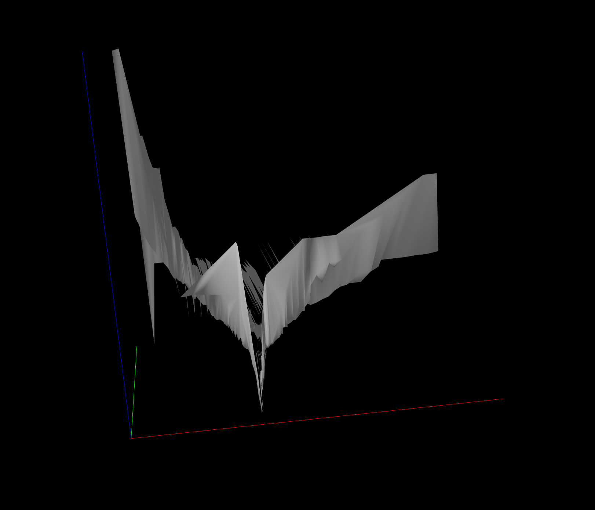

# Objective
The aim here is to build a tool that plots the volatility surface of a cryptocurrency in real-time using option data from Deribit. 

We will take in a stream of data from the Deribit websocket API and extract some key properties:
- Expiry date
- Strike
- Implied volatility

Fortunately, Deribit gives us this data immediately in the API call. Our job will be to organise and structure the data so that we can easily plot it in 3D. We will then need to render the surface (perhaps using the three-d crate) and ideally host it on a server. I have not worked with 3D plots outside of Python so I anticipate that this will be an interesting project.

# Build so far
So far I have implemented the logic to decode the instrument_name string from the Deribit websocket into a usable format. The main function of this is that it will allow us to immediately extract expiry dates for each option and determine whether it is a put or call using our enum. 

The function that allows us to take in each raw option data element from the list and convert into a usable format is ready.

# Todo
- [x] Actual error handling - we don't want to rely on .unwrap() where it can be avoided
- [x] Websocket integration
- [ ] Differentiate between puts and calls
- [x] Complete Delaunay triangulation
- [x] Render surface
- [ ] Efficient inclusion of new data
- [x] Refactor everything from the main function. In theory, I just want this to be the render loop while we pass off data collection and processing to a separate function
- [ ] Axes titles and scales

# Results
 \
Here we have the first render of the test data. The x axis (red) shows strike price, the y axis (green) shows time to expiry, and the z axis (blue) shows implied volatility. The render is highly fragmented and I couldn't manage to fix this despite adding anti-aliasing and using over 1,000 datapoints. The next step may be to have a smoothing function.
